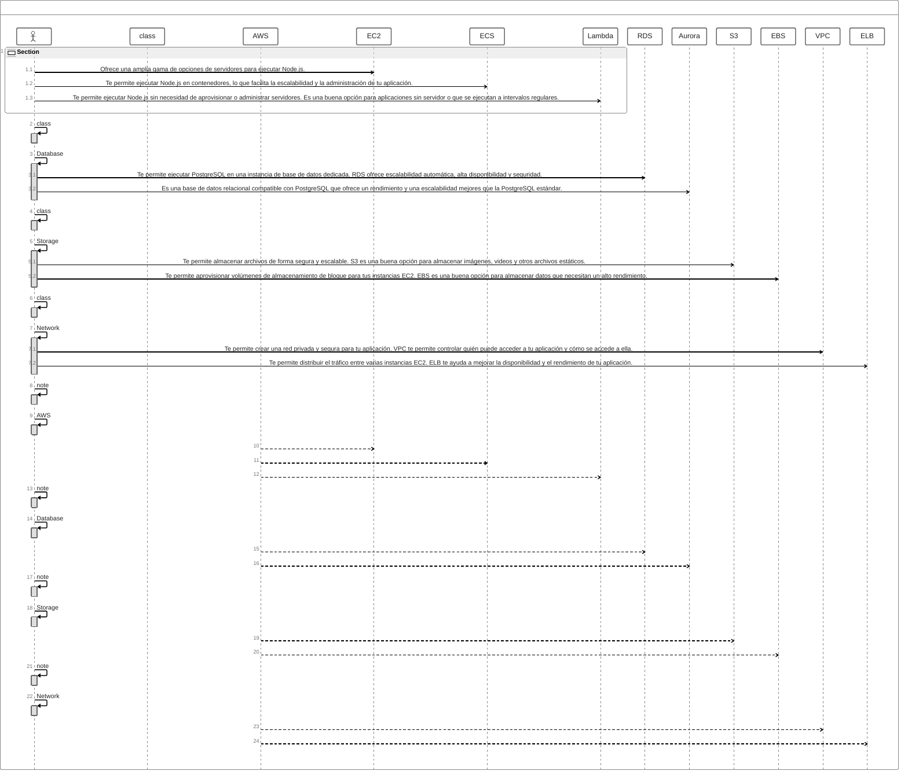

# Pruebas realizadas con vercel - luego con render para construir deploy de esta api online gratis

```mermaid
zenuml
    class AWS {
        EC2: Ofrece una amplia gama de opciones de servidores para ejecutar Node.js.
        ECS: Te permite ejecutar Node.js en contenedores, lo que facilita la escalabilidad y la administración de tu aplicación.
        Lambda: Te permite ejecutar Node.js sin necesidad de aprovisionar o administrar servidores. Es una buena opción para aplicaciones sin servidor o que se ejecutan a intervalos regulares.
    }

    class Database {
        RDS: Te permite ejecutar PostgreSQL en una instancia de base de datos dedicada. RDS ofrece escalabilidad automática, alta disponibilidad y seguridad.
        Aurora: Es una base de datos relacional compatible con PostgreSQL que ofrece un rendimiento y una escalabilidad mejores que la PostgreSQL estándar.
    }

    class Storage {
        S3: Te permite almacenar archivos de forma segura y escalable. S3 es una buena opción para almacenar imágenes, videos y otros archivos estáticos.
        EBS: Te permite aprovisionar volúmenes de almacenamiento de bloque para tus instancias EC2. EBS es una buena opción para almacenar datos que necesitan un alto rendimiento.
    }

    class Network {
        VPC: Te permite crear una red privada y segura para tu aplicación. VPC te permite controlar quién puede acceder a tu aplicación y cómo se accede a ella.
        ELB: Te permite distribuir el tráfico entre varias instancias EC2. ELB te ayuda a mejorar la disponibilidad y el rendimiento de tu aplicación.
    }

    note "AWS"
    AWS --> EC2
    AWS --> ECS
    AWS --> Lambda

    note "Database"
    AWS --> RDS
    AWS --> Aurora

    note "Storage"
    AWS --> S3
    AWS --> EBS

    note "Network"
    AWS --> VPC
    AWS --> ELB
```
